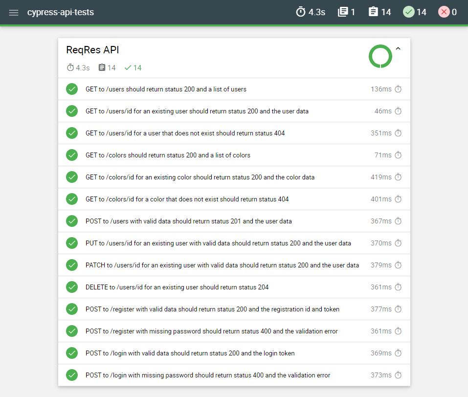
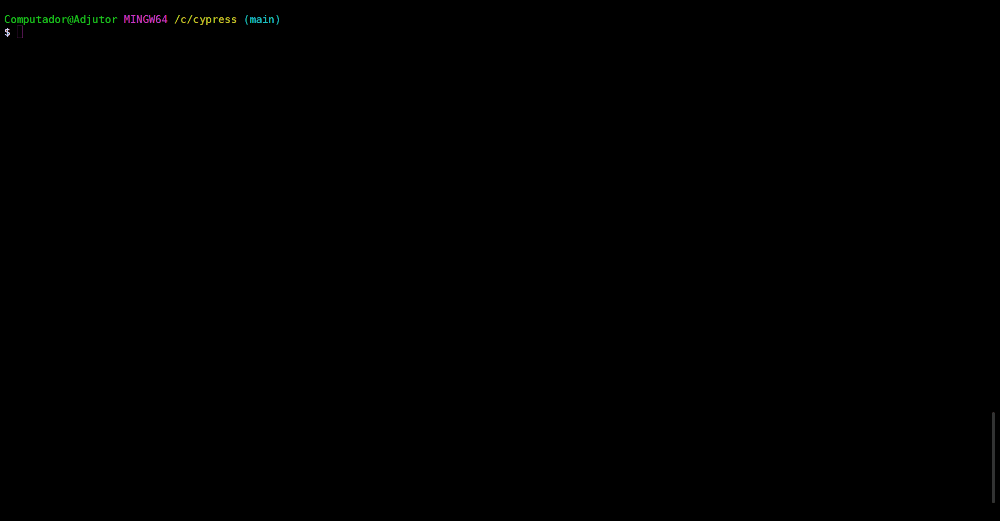

# Cypress

A sample API test automation project in [TypeScript](https://www.typescriptlang.org/), using [Cypress](https://www.cypress.io/) and [Mochawesome](https://github.com/adamgruber/mochawesome#readme).

## ReqRes

The API chosen for testing was ReqRes. It simulates how a real application behaves, is highly available and accessible from anywhere. For more information, visit their website [here](https://reqres.in/).

## How it works

The project uses Cypress as the test framework and Mochawesome to generate HTML reports.  
A workflow is set up to install Node.js, install the required packages, run the tests, and publish the HTML report to GitHub Pages. The report can be viewed [here](https://kafziel4.github.io/cypress-api-tests/).

## How to run it

- Install [Node.js](https://nodejs.org/en/)
- Install the project packages: `npm install`
- Run the tests and generate the report (Windows): `npm test`
- Delete previous reports (Windows): `npm run report-clean`

- Alternatively, use `npm run cy-open` to open the Test Runner and run the tests from there

